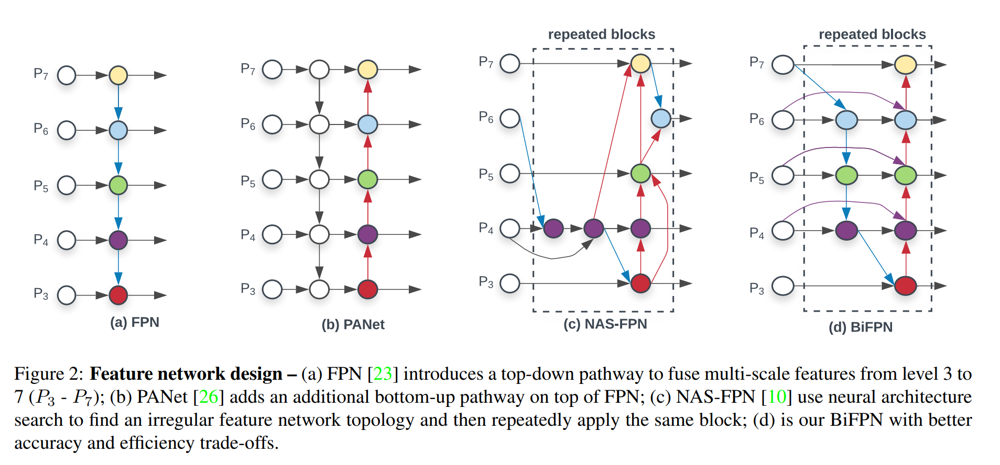

# Ball Finding possible Improvement
## Main Object 
The task Object is to minimize the center prediction as close as possible.
Since I lack the the understanding of all implementations, please ignore things you have tried or implemented.  
I will arrange the methods in an ascending order in terms of implementation difficult/effort.

## DIou Loss (More dedicated Design for Baseball)
For Yolov4, the author have introduced GIoU to generalize IoU regarding its incapability for cases like inclusion and non-overlapping (gradient vanishing).
Still, there is no refinement on the center prediction. 
Thus, adding penalty on center location prediction would definitely to force the model focus on the center point regression. 
[Distance-IoU Loss: Faster and Better Learning for Bounding Box Regression](https://arxiv.org/abs/1911.08287)

The complete CIoU gives:
$$\mathrm{CIoU}(B_{\mathrm{gt}}, B_{\mathrm{pred}}) = 1 - IoU + \frac{\rho^2(B_{\mathrm{gt}}, B_{\mathrm{pred}})}{c^2} + \alpha v$$
where the $\alpha v$ is a trade-off term for aspect ratio of bounding boxes.

However, Baseball, in particular, is always circle-shaped in the captured frames. There is no need to keep bounding boxes beside squares. 
Thus, there is no need to consider for the trade-off term for aspect ratio, which could boost bounding box regression process as well as accuracy.
So, we can just apply the DIoU.
$$\mathrm{DIoU}(B_{\mathrm{gt}}, B_{\mathrm{pred}}) = 1 - IoU + \frac{\rho^2(B_{\mathrm{gt}}, B_{\mathrm{pred}})}{c^2}$$
where gt denotes ground_truth here.b and $b_{gt}$ denote the central points of B and $B_{gt}$, 
$\rho(·)$ is the Euclidean distance, and c is the diagonal length of the smallest enclosing box covering the two boxes.

## Image tiling/focusing
The diffculty of baseball finding falls in the small object detection.
Our experiment of the feature pyramid segmentation, which improved the center regression revealed that the feature fusion netword in Yolov4 decoder head is not what we expected for small object detection.
Hence, It is promising to keep this Focus-and-Detect scheme. 
Multiple papers have investigated the benefit of image tiling in small object detection, in other words, zoom in to image patches and detect. Here is an example.
[The Power of Tiling for Small Object Detection](https://openaccess.thecvf.com/content_CVPRW_2019/papers/UAVision/Unel_The_Power_of_Tiling_for_Small_Object_Detection_CVPRW_2019_paper.pdf)

[Image-tiling](images/image tiling .png)

Moreover, the content of our image is carefully chosen each time we place the camera, in which the ball trajectory will be centralized. 
Based on this, it is possible to customize and pre-define some region of intrests for image tiling.

## Feature Pyramid Network (FPN)
In Yolov4 decoder head, feature maps were divided to 3 scales to deal with large, mid and small objects. The connection is limited to one-direction information flow, top-to-bottom.
As mentioned, our experiment also indicated its limitation. 

There is a room to improve the Feature Pyramid Network by making bi-directional connection across multi-scale features. 

Besides, the authors of EfficientDet pointed out that features of different scales contribute to prediction uneually, which means there is a need to learn the weights.
The [EffcientDet](https://arxiv.org/pdf/1911.09070.pdf) have provided a good implementation of bi-directional FPN with learnable weights on feature maps in different scales. 
It is reasonable to deduce that having sub-global region information might help to locate the baseball and the multi-scale feature is highly likely beneficial to small object detecion.

As further discussion, we could even add handcrafted weights to force the model to small-scale feature maps.(Just Intuition) 
