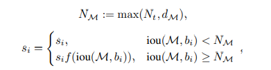

# NMS 改进思路

1. 根据手动设置阈值的缺陷，通过自适应的方法在目标系数时使用小阈值，目标稠密时使用大阈值。例如Adaptive NMS

2. 将低于阈值的直接置为0的做法太hard，通过将其根据IoU大小来进行惩罚衰减，则变得更加soft。例如Soft NMS，Softer NMS。

3. 只能在CPU上运行，速度太慢的改进思路有三个，一个是设计在GPU上的NMS，如CUDA NMS，一个是设计更快的NMS，如Fast NMS，最后一个是掀桌子，设计一个神经网络来实现NMS，如ConvNMS。

4. IoU的做法存在一定缺陷，改进思路是将目标尺度、距离引进IoU的考虑中。如DIoU。


# Traditional NMS
1. hand-crafted hard threshold.
2. sequentially computing. Inefficient.
3. IoU loss is limited in terms of aspect ratio, center prediction, inclusive relation.

code :

```
import numpy as np

def iou(box1, box2):
    """
    Compute the Intersection over Union (IoU) between two boxes.
    
    Args:
    - box1: array of shape (4,), representing (x1, y1, x2, y2).
    - box2: array of shape (4,), representing (x1, y1, x2, y2).
    
    Returns:
    - IoU value
    """
    xx1 = max(box1[0], box2[0])
    yy1 = max(box1[1], box2[1])
    xx2 = min(box1[2], box2[2])
    yy2 = min(box1[3], box2[3])

    w = max(0, xx2 - xx1 + 1)
    h = max(0, yy2 - yy1 + 1)

    inter = w * h
    area1 = (box1[2] - box1[0] + 1) * (box1[3] - box1[1] + 1)
    area2 = (box2[2] - box2[0] + 1) * (box2[3] - box2[1] + 1)
    
    return inter / (area1 + area2 - inter)

def nms(boxes, scores, threshold):
    if len(boxes) == 0:
        return []

    # Sort boxes by their scores
    order = scores.argsort()[::-1]
    keep = []

    while order.size > 0:
        i = order[0]
        keep.append(i)

        overlaps = np.array([iou(boxes[i], boxes[j]) for j in order[1:]])
        inds = np.where(overlaps <= threshold)[0]

        order = order[inds + 1]

    return keep

# Example:
boxes = np.array([[50, 50, 150, 150], [55, 55, 155, 155], [150, 150, 250, 250]])
scores = np.array([0.8, 0.9, 0.7])
threshold = 0.5
print(nms(boxes, scores, threshold))  # Expected output: [1, 2] 
```

# Soft NMS

B isn't discarded immediately.
The overlap (IoU) between A and B is used to decrease B's score by a calculated factor.
Only boxes with scores that fall below a certain threshold after suppression are discarded.
The decrease in the score is typically done using one of these methods:

Linear: new_score = score * (1 - IoU)

Gaussian: new_score = score * exp(-IoU^2 / sigma)

Filter out new_socre below a certain threshold , say 0.001. 

code 
```
import numpy as np

def iou(box1, box2):
    xx1 = max(box1[0], box2[0])
    yy1 = max(box1[1], box2[1])
    xx2 = min(box1[2], box2[2])
    yy2 = min(box1[3], box2[3])
    w = max(0, xx2 - xx1 + 1)
    h = max(0, yy2 - yy1 + 1)
    inter = w * h
    area1 = (box1[2] - box1[0] + 1) * (box1[3] - box1[1] + 1)
    area2 = (box2[2] - box2[0] + 1) * (box2[3] - box2[1] + 1)
    return inter / (area1 + area2 - inter)

def soft_nms(boxes, scores, threshold=0.3, method='linear', sigma=0.5):
    N = len(boxes)
    for i in range(N):
        max_score_idx = i + np.argmax(scores[i:])
        boxes[i], boxes[max_score_idx] = boxes[max_score_idx], boxes[i]
        scores[i], scores[max_score_idx] = scores[max_score_idx], scores[i]

        for j in range(i+1, N):
            overlap = iou(boxes[i], boxes[j])
            if method == 'linear':
                decay = (1 - overlap) if overlap > threshold else 1
            elif method == 'gaussian':
                decay = np.exp(-(overlap * overlap) / sigma)
            else:
                raise ValueError('Method not recognized')
            scores[j] *= decay
            
    # Filter out boxes with scores below a certain threshold (e.g., 0.001)
    keep = [i for i in range(N) if scores[i] > 0.001]
    
    return np.array(keep)

# Example:
boxes = np.array([[50, 50, 150, 150], [55, 55, 155, 155], [150, 150, 250, 250]])
scores = np.array([0.8, 0.9, 0.7])
print(soft_nms(boxes, scores))

```


# softer NMS
https://ayameyao.github.io/NMS/Chapter3/3argroad3.html

# Adaptive NMS
However, computational consuming, may raise performance drop.
Could increase recall in crowded area.

Actually, both the design of greedy-NMS and soft-NMS
follows the same hypothesis: the detection boxes with
higher overlaps with M should have a higher likelihood
of being false positives. This hypothesis has no problem
when it is used in general object detection, as occlusions
in a crowd rarely happen.

Idea:  adapt higher threshold (prediction of Density , which is the max IoU of M by others)


Requires a prediction network on top of detector head (one-stage) or RPN network (two-stage).



For M at crowded region, use a larger threshold.

```
import numpy as np

def iou(box1, box2):
    xx1 = max(box1[0], box2[0])
    yy1 = max(box1[1], box2[1])
    xx2 = min(box1[2], box2[2])
    yy2 = min(box1[3], box2[3])
    w = max(0, xx2 - xx1 + 1)
    h = max(0, yy2 - yy1 + 1)
    inter = w * h
    area1 = (box1[2] - box1[0] + 1) * (box1[3] - box1[1] + 1)
    area2 = (box2[2] - box2[0] + 1) * (box2[3] - box2[1] + 1)
    return inter / (area1 + area2 - inter)

def adaptive_nms(boxes, scores, base_threshold=0.5, threshold_increment=0.05, max_neighbors=5):
    N = len(boxes)
    indices = np.argsort(scores)[::-1]
    keep = []

    while len(indices) > 0:
        current = indices[0]
        keep.append(current)
        
        # Compute overlap with remaining boxes
        overlaps = np.array([iou(boxes[current], boxes[i]) for i in indices[1:]])
        
        # Count neighbors (based on the base threshold)
        neighbor_count = np.sum(overlaps > base_threshold)
        
        # Calculate adaptive threshold
        adaptive_threshold = base_threshold + min(neighbor_count, max_neighbors) * threshold_increment
        
        # Filter indices based on adaptive threshold
        indices = indices[1:][overlaps < adaptive_threshold]

    return np.array(keep)

# Example:
boxes = np.array([[50, 50, 150, 150], [55, 55, 155, 155], [150, 150, 250, 250]])
scores = np.array([0.8, 0.9, 0.7])
print(adaptive_nms(boxes, scores))
```


