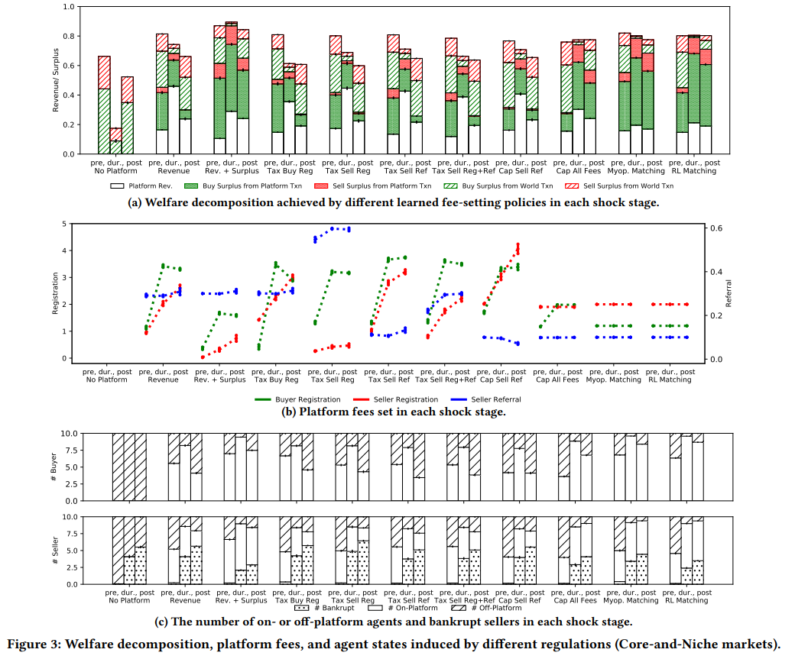
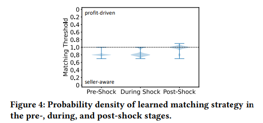
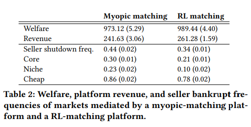

在疫情或经济遭受冲击时，以什么方式应对冲击，这永远是摆在人类面前的问题。
platform Behavior under Market Shocks: A Simulation Framework and Reinforcement-Learning Based Study 给出了从AI视角来看待对经济体系干预的办法，以及给出了经济平台应对冲击时可行的方法。

文章研究了经济平台（例如亚马逊、Uber Eats、Instacart）在冲击（例如COVID-19封锁）下的行为，以及不同监管考虑因素的影响。文章主要提出了： 
（1）作者开发了一个多期设置的平台经济多代理模拟环境，其中可能发生冲击并扰乱经济。并考虑两种主要类型的监管框架：税收政策和平台费用限制。  
（2）文章的实验结果表明，虽然许多干预措施对于一个复杂的平台是无效的，但作者提出了一种RL平台匹配算法，保持与在没有经济冲击的情况下选择的费用结构相同，同时允许平台根据冲击调整其匹配政策，有望促进经济系统的效率和韧性。 

小节1，2详细介绍市场环境的模拟和决策的逻辑。小节3会对模拟经济冲击下，不同监管干预策略带来的结果进行展示和分析。

## 1.决策模型
### 1.1 市场环境以及交易规则： 
市场由买家B、卖家S和单一平台p组成。 在特征空间中， $v_b,v_s\subseteq[0,1]$ 分别表示了卖家和买家的信息。 
第一个维度是商品种类，拿食物举例就是，意大利菜，日本菜等， 第二个维度则是价格水平，商家售出的价格， $v_s$， 在 $\omega_s$的成本下。
每个买家知道一部分的卖家，可以在不经过平台的情况下，同这部分卖家进行现实交易。
现实交易系数µk>0,表示在真实世界的交易成本(不使用平台)。

**每个epoch k的开始： **
平台设置买家和卖家的订阅费用 $P_{B,k}\ge0,P_{S,k}\ge0$ 和推荐费 $P_{R,k}\subseteq[0,1]$,推荐费代表在一单交易中，卖方承担的交易费比例。
买家和卖家是可以观察到平台订阅费用和现实交易系数 $\mu_k\gt0$， 也就是线下交易的成本，决定是否订阅付费使用平台。
对于买家有一个预算限制 $psi_b\gt0$，这个预算与买方的偏好价格 $v_b^1$正相关，用于限制每个epoch中单个买家的交易上限。

**对于每个epoch中的每个时间节点t： **
(1) 买家发出查询(Query),包含食物种类以及偏好价格。
(2) 平台进行匹配(Match)，平台寻找线上商家中匹配的商家。
(3) 进行交易(Transaction)。买家在自己已知的线下商家 $S_b$ 和平台匹配的商家 $s_{p.t}$中选择更省钱的选项。

**在每个epoch k结束时： **
买家和卖家评估其交易费用（是否给自身带来盈余，下节会讲到，简单理解就是是否比线下交易更省钱）， 决策未来是否订阅。平台评估所获得的收入，以调整费用或匹配策略。
每个卖家都有一个关闭门槛，如果在连续的𝜆𝑠个周期内未获得正的盈余，则会破产，不进入以后的epoch的模拟。

### 1.2 用户层面决策
在交易层面保证公平的选择实时最优交易策略。每个agent选择时，基于最大化自身交易盈余的原则，即最大化现实交易与选择在平台上交易的费用差。

**现实世界中的选择： **
在现实世界中所知卖家的最优选择是： $argmax_{s\in S_{b,t}}u_B(q_{b.t},s_{b,t}^w)$ 
现实世界交易的盈余表示为：
$$u_{b,t}^w=max(u_B(q_{b.t},s_{b,t}^w)-\mu_k,0)$$
$u_B(q,s)$反映匹配的质量, $s_{b,t}^w$ 表示在时间点t时，买家(b)在现实世界(w)的交易选项。

**平台上的选择： **
同样的：
$$u_{b,t} = u_B(q_{b.t},s_{b,t})$$

**总体选择： **
如果卖方不能提供一个正的盈余，买方将不会选择交易。
在时间t时，总体的选择，包括买家的查询，买家，卖家的交易选项用一个tuple来表示： $(q_{b,t},s_{b,t}^w,s_{p,t},s_{b,t})$

**交易盈余： **
买家的盈余是： $r_{b,t}=max(u_{b,t}^w,u_{b,t}^p)$，也就是平台和现实交易盈余的最大值。 
卖家的盈余是：

$$
r_{s,t} =
\begin{cases}
v_s^1(1-\omega_s-P_{R,k}) & \text{for a platform transaction} \\
v_s^1(1-\omega_s) & \text{for a non-platform transaction} \\
0 & \text{otherwise}
\end{cases}
$$

**每个epoch的盈余以及平台收入： **
买家的epoch盈余：一个epoch中来自于平台匹配的总盈余减去订阅平台支付的费用。 
卖家的epoch盈余：一个epoch中来自于平台匹配的总收入减去订阅平台支付的费用。 
平台的总收入：订阅费用以及推荐费的总和。 

### 1.3 订阅决策细节
**估计订阅决策的影响 **
在每个epoch的开始，用户（买卖方）会醒来，重新根据目前的状态，过去的交易进行决定是否再次订阅。

**agent的行为惯性 **
文章在模拟模型中考虑到了每个agent的行为惯性，也就是代理有保持现在的订阅决策不变的倾向。以epoch的对数级别对行为惯性进行模拟。

## 2 平台层面决策
### 2.1 短视查询匹配（Myopic Matching）：
短视查询匹配，使用环境中可观察到的买家以及卖家信息，将其嵌入到特征空间（latent space）中. 推荐特征空间中最接近查询的卖家，从而为买家产生最高效用。短时匹配机制将作为实验的参照标准。

**描述这一过程的POMDP(部分可观察马克洛夫环境)： **
**state： **
（1）买家属性：潜在位置(latent location)、时代预算、查询分布以及对世界卖家的了解， 
（2）卖家属性：潜在位置、成本比例和关闭阈值， 
（3）agent的订阅状态：订阅平台与否。 用两个0，1 mask表示：$I_{B,k-1}^P$, $I_{S,k-1}^P$, 
（4）agent的惯性水平： $\chi_{b,k-1}$, $\chi_{s,k-1}$, 
（5）上一epoch的查询，卖家买家选项的序列, 
（6）卖家关闭状态：卖家是否在上一epoch关闭， 
（7）上一epoch的订阅费用, 
（8）现实交易系数 $\mu_k$.  

**action: **
$a_k=(P_{B,k-1},P_{S,k-1},P_{R,k-1})$

**state transition: **
买家和（可行的）卖家遵循他们的选择模型来订阅平台，从而产生新的订阅状态和惯性水平。对于每个时间步长𝑡∈𝑘，遵循“查询、匹配、交易”动态，这给出了一个完整的序列𝑄𝑘。每个可行的卖家可以根据epoch 𝑘的剩余量和他们的关闭阈值来决定关闭。费用随采取的行动而定，世界交易摩擦根据对数正态过程演变。

**reward: **
当代理订阅和交易结果可用时，奖励𝑟𝑘∼R(𝑥𝑘, 𝑎𝑘)将提供给平台。奖励可以设置为模拟不同平台目标，整合来自监管的考虑因素。

**platform observation: **
平台的观察 $O_{k+1}\in\Omega$ 包括由平台上的买家生成的查询序列，以及他们是否通过平台进行交易的决策，

### 2.2 RL固定费率查询匹配
短视匹配会更倾向于买家，为了完整的衡量对于所有参与者的收益，文章提出了2个参数： （1）a matching utility threshold，匹配效用阈值  $\eta\in[0,1]$ 指定了推荐的卖家应该提供给买家的最低效用，作为短视最优匹配效用的一部分。 （2）matching rule，匹配规则，这是指导如何在符合该效用阈值的卖家中选择一个卖家的方式。 
作者提出了两种匹配规则：“基于卖家盈余的匹配规则” 和 “基于平台利润的匹配规则”。在这样的设置下，短视匹配就可以视为 $\eta=1$ 情况下的特例。平台的目标是通过RL学习到最优的效用阈值和匹配规则，以最大化下一epoch中买家以及卖家的订阅量

**寻找最优匹配策略： **
平台与买家和卖家之间的互动可以看作是一个斯塔克伯格博弈，平台是先手(leader)，买方和卖方是后手(followers)。在这样的设置下，通过最大化累计奖励，平台将会学习到一个费率设置，或者匹配规则。
$$\underset{\pi}max E_{a\sim\pi,\chi\sim P}[\sum_{k=0}^K\gamma^kr_k]$$

## 3 实验结果和分析
在上述的模拟下，为了探究在经济冲击下不同的政策会导致的影响，文章对监管干预方式：（1）无干预（对照）(2）征税政策 （3）费用上限 （4）本文提出的RL平台匹配方法，进行了模拟实验。下图展示了实验结果

### 实验1：无干预。
从图3a可以看出，平台通常会提高整体交易盈余。首先，通过比较前冲击期和后冲击期（即同一列的左右两个柱状图），我们发现，无论有无平台，整体交易盈余都在冲击之后下降。这是由于卖家破产，导致买家只能与不太理想的卖家匹配。

### 实验2：征税政策。
结果表明，征税政策与自由放任的系统导致的结果相似，并且由于破产的卖家，震荡后整体盈余下降。平台学会了降低某种类型的费用，并提高其他费用，以在税收政策下最大化其利润。虽然一些卖家获得更高的盈余，但平台上的买家却会因此承受更大的损失。

### 实验3：设置上限的平台费用。
与征收转介利润税类似，平台会通过提高注册费用来回应这一政策（图3b第8列）。这导致更多的买家和卖家选择离开平台，特别是在冲击之前，从而减少了平台内部的剩余价值。作者还考虑了所有费用都受限制的情况，其中 $𝑃_{B,𝑘}≤ 2.0$,  $𝑃_{S,𝑘}≤ 2.0$, and  $𝑃_{𝑅,𝑘} ≤ 0.1$。如图3b第9列所示，在这些限制下，平台选择设置最大可能的费用，除了在冲击之前设置较低的买家注册费用。这些限制能够引导平台制定有利于经济体系的政策，其中整体福利不会受到冲击，有许多可行的卖家和好的买家匹配仍然存在。同时，这种干预措施需要监管机构的知识和了解。

### 实验4：使用提出的RL平台匹配方法
在这种情况下，平台被要求保持与无经济冲击世界中选择的最优费用结构相同。平台根据冲击情况来调整其匹配策略。这种情况具有重要意义，因为干预措施仅使用监管机构可用的知识，并且不假定平台采用特定的匹配方法。这在实践中具有相关性，因为匹配是专有的，通常由于缺乏透明度而难以监管。

按照第3.2节的方法，考虑一个平台，该平台使用强化学习来学习匹配策略，但使用基于无冲击情况下BO使用的优化收入的固定费用（$𝑃_{B,𝑘} = 1.2$， $𝑃_{S,𝑘} = 2.0$， $𝑃_{𝑅,𝑘} = 0.1$）。如图3的右列所示，即使在匹配选择方面具有灵活性，平台的存在也有助于经济在冲击后保持与冲击前相似的福利水平，并导致破产的卖家更少。图4中显示了平台学习的匹配策略。为了最大化收入，平台通常采用卖家感知规则，既在冲击之前又在冲击期间，将买家与剩余价值较低的卖家匹配。这可以解释为：(1)受管制的费用激励平台通过匹配留住更多的卖家，以便从注册费中产生收入，(2)平台在匹配方面具有更多的灵活性，因为冲击影响了世界交易，因此可以在不失去买家交易的情况下在匹配质量上做出一些让步。随着冲击的消退，平台随后学习增加匹配效用阈值，以提供更好的匹配给买家。

如表2所示，与短视匹配相比，强化学习匹配平台实现了更高的收入和总福利（再次反映了与监管机构利益的一致性）。强化学习匹配平台还学会了大幅降低廉价和利基卖家破产的概率。

## 4 总结： 
作者提出的经济市场模拟，这给了我们提供了一种从AI角度分析市场经济的方法，从而更全面理性的选择经济干预的办法。同时，该文提出的基于RL的平台匹配策略，在实验中的表现使得总体的盈余或福利更高，与常见的干预策略比如提高税率相比大大减少卖家破产的概率，或许是对于市场平台匹配策略在遭受经济冲击状况下的更优解。在人类面对可能发生的经济危机时，这或许是一种全新的思路和方法。

